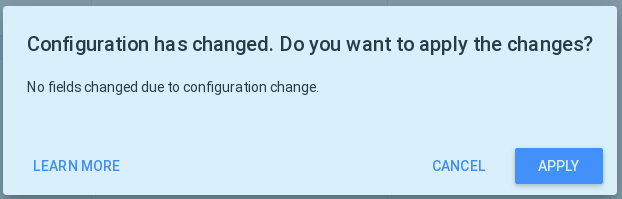

# Build an SLO achievements report using BigQuery and DataStudio

This template provides a basic dashboard with 3 views:

* `Morning snapshot`: last error budget and SLI achievement, support decisions agreed in the Error Budget Policy.

* `Trends`: SLI vs SLO by service/feature over a period of time.

* `Alerting on burnrate`: visualize when alerting engage and fade off by sliding window sizes

## Prerequisites

### Setup the BigQuery exporter

In order to setup a DataStudio report, make sure `slo-generator` is configured
to export to a BigQuery dataset (see [instructions here](../providers/bigquery.md)).

### Create a BigQuery view

Replace the variables `PROJECT_ID`, `DATASET_ID` and `TABLE_ID` in the
content below by the values configured in your BigQuery exporter, and put it
into a file `create_view.sql`:

```sql
CREATE VIEW <PROJECT_ID>.<DATASET_ID>.last_report AS
SELECT
   r2.*
FROM
   (
      SELECT
         r.service_name,
         r.feature_name,
         r.slo_name,
         r.window,
         MAX(r.timestamp_human) AS timestamp_human
      FROM
         <PROJECT_ID>.<DATASET_ID>.<TABLE_ID> AS r
      GROUP BY
         r.service_name,
         r.feature_name,
         r.slo_name,
         r.window
      ORDER BY
         r.window
   )
   AS latest_report
   INNER JOIN
      <PROJECT_ID>.<DATASET_ID>.<TABLE_ID> AS r2
      ON r2.service_name = latest_report.service_name
      AND r2.feature_name = latest_report.feature_name
      AND r2.slo_name = latest_report.slo_name
      AND r2.window = latest_report.window
      AND r2.timestamp_human = latest_report.timestamp_human
ORDER BY
   r2.service_name,
   r2.feature_name,
   r2.slo_name,
   r2.error_budget_policy_step_name
```

Run it with the BigQuery CLI using:

```sh
bq query `cat create_view.sql`
```

Alternatively, you can create the view above with Terraform.

## Setup DataStudio SLO achievements report

1. The user that would own this report has sufficient access to the BQ data set where the aforementioned
view and table resides. This would require provisioning BQ access to the report owner, at minimum as BQ User and
BQ Data Viewer roles.
2. You also need the fully qualified name of view or table in this format `<project-id>.<dataset-name>.<view-or-table-name>`
3. Table `report` in SLO Generator Bigquery dataset
4. View `last_report` in SLO Generator Bigquery dataset.

### 1. Copy the data sources

#### 1.a. `report` data source

##### Step 1

Make a copy of the following data source (copy & paste the below link in a browser)
<https://datastudio.google.com/datasources/24648dbe-fa29-48bf-9227-7e8673319968>
and clicking on the "Make a Copy" button just left of the "Create Report" button.  


##### Step 2

From the BQ connector settings page use "My projects" search and select your SLO-generator project ID, then your dataset, usually `slo_reports`, then table "reports".

##### Step 3

Hit the RECONNECT button top right.The message `Configuration has changed. Do you want to apply the changes?` appears indicating no fields changed. Hit APPLY.  


##### Step 4

Change the data source name at the top left corner from "Copy of..." to something appropriate.
You can close this browser window now.

### 1.b `last_report` data source

Repeat the previous steps for the second data source starting by using this URL:
<https://datastudio.google.com/datasources/e21bfc1b-70c7-46e9-b851-652c6ce0eb15>
and selecting the table "last_report" from your project, your dataset.

### 2. Copy the report template

#### Step A

Open the report template from this URL: <https://datastudio.google.com/reporting/964e185c-6ca0-4ed8-809d-425e22568aa0> check you are in view mode, and click on the "Make a Copy" button between the fullscreen button and the refresh button on top right of the screen.

#### Step B

Point the "New Data source" to the two newly created data sources from the above steps and click `Copy Report`.


