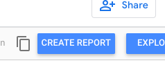
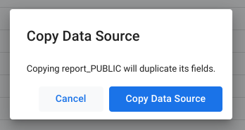
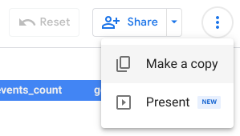
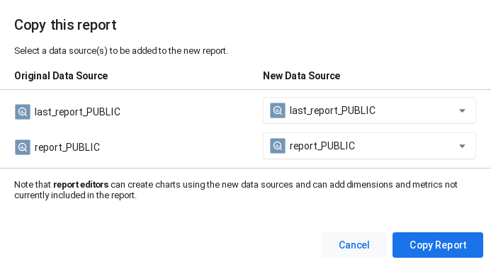

# Build an SLO achievements report using BigQuery and Looker Studio

This template provides a basic dashboard with 3 views:

* `Morning snapshot`: last error budget and SLI achievement, to support decisions documented in the Error Budget Policy.

* `Trends`: SLI vs SLO by service/feature over a given window.

* `Alerting on burnrate`: visualize when alerting engages and fades off by sliding window sizes

## Prerequisites

### Setup the BigQuery exporter

In order to setup a Looker Studio report, make sure `slo-generator` is configured to export to a BigQuery dataset (see [instructions here](../providers/bigquery.md)).

### Create a BigQuery view

Populate the `PROJECT_ID`, `DATASET_ID` and `TABLE_ID` environment variables below so they match the values configured in your BigQuery exporter, then generate a BigQuery SQL query responsible for creating a view and store it in `create_view.sql` with:

```sh
export PROJECT_ID=<PROJECT_ID>
export DATASET_ID=<DATASET_ID>
export TABLE_ID=<TABLE_ID>

cat > create_view.sql << EOF
CREATE VIEW `${PROJECT_ID}.${DATASET_ID}.last_report` AS
SELECT
   r2.*
FROM
   (
      SELECT
         r.service_name,
         r.feature_name,
         r.slo_name,
         r.window,
         MAX(r.timestamp_human) AS timestamp_human
      FROM
         `${PROJECT_ID}.${DATASET_ID}.${TABLE_ID}` AS r
      GROUP BY
         r.service_name,
         r.feature_name,
         r.slo_name,
         r.window
      ORDER BY
         r.window
   )
   AS latest_report
   INNER JOIN
      `${PROJECT_ID}.${DATASET_ID}.${TABLE_ID}` AS r2
      ON r2.service_name = latest_report.service_name
      AND r2.feature_name = latest_report.feature_name
      AND r2.slo_name = latest_report.slo_name
      AND r2.window = latest_report.window
      AND r2.timestamp_human = latest_report.timestamp_human
ORDER BY
   r2.service_name,
   r2.feature_name,
   r2.slo_name,
   r2.error_budget_policy_step_name
EOF
```

Run the query using the BigQuery CLI with:

```sh
bq query --use_legacy_sql=false < create_view.sql
```

Alternatively, you can create the view above with Terraform.

## Setup Looker Studio report

Prerequisites:

1. The user owning this report must have access to the BigQuery dataset where the aforementioned view and table reside, for example with the **BigQuery User** and **BigQuery Data Viewer** roles at the dataset or project level.
2. You also need the fully qualified names of the `last_report` view and the `report` table, formatted as `<project-id>.<dataset-name>.<view-or-table-name>`.

### 1. Copy the data sources

#### 1.a. `report` data source

##### Step 1

Make a copy of the following data source (copy & paste the link in a browser) by clicking the **Make a copy of this datasource** button (just left of the **Create Report** button) and confirming with **Copy Data Source**:

https://datastudio.google.com/datasources/24648dbe-fa29-48bf-9227-7e8673319968





##### Step 2

From the BigQuery connector settings page, select your SLO Generator project ID from the **My projects** category on the left, then select your dataset (usually `slo_reports`) and finally your table (usually `reports`).

##### Step 3

Hit the **Reconnect** button at the top right, then click **Apply** on the next confirmation dialog.

##### Step 4

Change the name of the data source name at the top left, from **Copy of...** to something more relevant and meaningful.

At this point, feel free to close the current browser tab and move on to the next step.

#### 1.b. `last_report` data source

Repeat the previous steps for the second data source available at the URL below. Select the `last_report` view from the same project and dataset.

https://datastudio.google.com/datasources/e21bfc1b-70c7-46e9-b851-652c6ce0eb15

### 2. Copy the report template

#### Step A

Open the report template at this URL:

https://datastudio.google.com/reporting/964e185c-6ca0-4ed8-809d-425e22568aa0

Confirm that you are in **View** mode, then click the **Make a Copy** button from the **More options** (three dots) menu.



#### Step B

Configure the two **New Data source** fields so they point to the two newly-created data sources from the above steps, then `Copy Report`.


