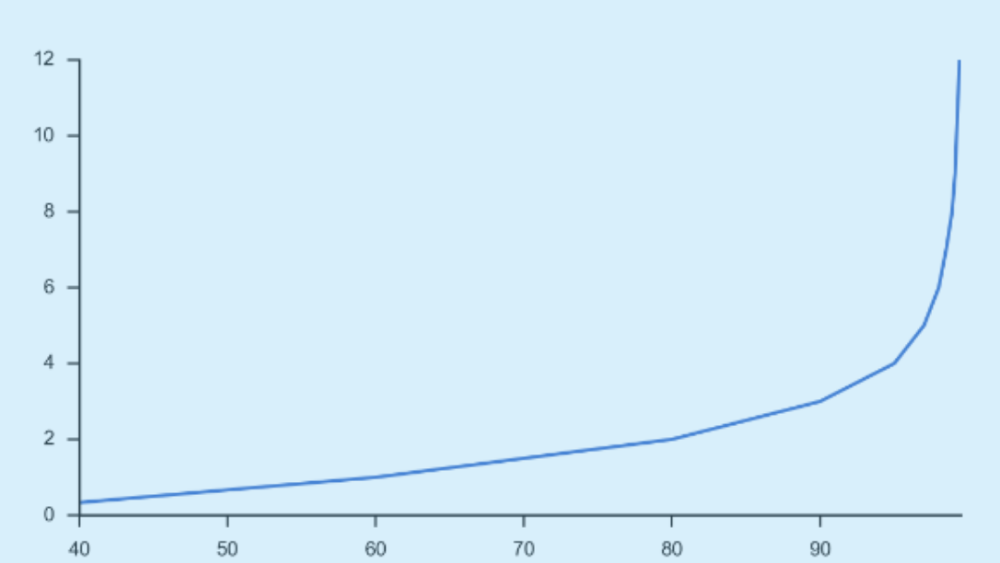
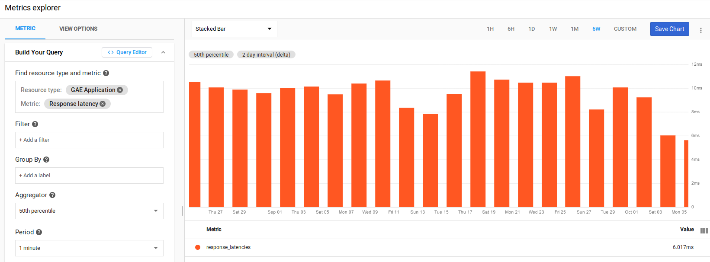
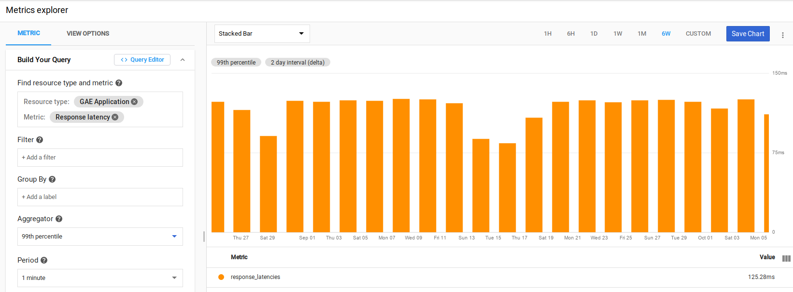

# How to define a latency SLI-SLO from an exponential distribution metric in Cloud Monitoring

## A - Define a latency SLI-SLO homogeneously with the any other SLIs-SLOs

SLI = Service Level Indicator
SLO = Service Level Objective

**Best practice:** define ALL SLI-SLOs on the same model: **SLI (%) = good events count / valid events count**, for a given timeframe.

Implementing this best practice means defining a latency SLI as the proportion (%) of good events (i.e served faster than xx ms) over valid events.

Example:

* Authentication response 100ms = 50%
* Authentication response 900ms = 99%
* Authentication response 4s = 99.99%

**It is therefore key to indicate the latency threshold (in ms) in the title of the SLI-SLO, since the value of a proportion (%) is always non-dimensional.**

Having a 50% goal (aka SLO) is OK for very small latencies (the median actually). Not all latency SLOs are necessarily expressed with 9s.

That being said, some monitoring systems may represent the latency in the other direction (see [here](../providers/datadog.md#datadog-api-considerations). In this case, the question is: "For a given percentile (median, 95th, 99th) what is the max value of the threshold?"

It is indeed the same curve, but in one case we give X the abscissa, i.e. the percentile and the system answers Y the ordinate (the duration), in the other case we give Y l 'ordinate and the system answers X the abscissa.



In the example above:

* SLI latency 10 seconds = 99%
* SLI latency 500 ms = 50%

Alternative approach:

* Latency at 99th = 10 seconds
* the median latency = 500ms

 With SLO Generator we set the bucket threshold and the system responds with a %. Doing this ensures the latency SLIs are homogeneous with the other SLIs.

So in this perspective your question "how to do a latency SLO at the 99th percentile?" will <span class="x x-first x-last">become </span>"What is the threshold in <span class="x x-first x-last">`ms`</span> which results in a proportion close to 99%?"

## B - Use distribution-type metrics for latency

It is often too expensive for the monitoring system to record the latency of each response served (full distribution).

In order to limit the number of data points we use in distributions, monitoring backends usually keep an aggregate counting how many requests have been served with a latency between 2 values ​​(lower and upper limit).

We lose precision, but we gain a stable storage of time series regardless of the volume of qps (query per sec).

## C - Find the typical bucket of the distribution metric and the associated border values

There are different ways of doing distributions in Cloud Operation Monitoring: **linear, custom or exponential**. These are the [Bucket Options](https://cloud.google.com/monitoring/api/ref_v3/rest/v3/TypedValue#bucketoptions) of the DISTRIBUTION type metrics.

Olivier Cervello's [gmon](https://github.com/GoogleCloudPlatform/professional-services/tree/master/tools/gmon)'s tool helps to inspect some data points of the last time series recorded on a metric

Example: `gmon metrics inspect loadbalancing.googleapis.com/https/backend_latencies -p <PROJECT_ID> --window 240`

Adapt the window size until you get data points, just one is enough.

The response contains the latency distribution [Bucket Options](https://cloud.google.com/monitoring/api/ref_v3/rest/v3/TypedValue#bucketoptions). (This information is not returned by the GET on the metric descriptor, c for that we need an inspect time series)

This looks like:

```json
'bucketOptions': {'exponentialBuckets': {'growthFactor': 1.4142135623730951,
                                         'numFiniteBuckets': 64,
                                         'scale': 1.0}},
```

Once we have the type of buckets (Explicit, Linear, Exponential) we can calculate the min and max values ​​of each bucket of the distribution type metric.

As an example let’s use AppEngine latency (see above): exponential type, grow factor is square root of 2, 64 finite buckets, so 66 in total (+ and - l infinity)

 This [Google Sheet](https://docs.google.com/spreadsheets/d/1pvGC_BW1l0D1D8GJY8I3H4QL76xVQ8t0QF_dIQ5lg5I/edit?usp=sharing)  allows to calculate the border values ​​of each bucket of an exponential distribution knowing these parameters (growfactor, numFiniteBuckets and scale)

**The SLI-SLO threshold MUST be aligned with one of the border values, since we are blind between 2 borders** (see the trade off distributive explained above).

 In SLO Generator we directly indicate the number of the bucket corresponding to the value of the top fontiere of the bucket as in this [yaml example](https://github.com/google/slo-generator/blob/master/tools/slo-generator/samples/stackdriver/slo_gae_app_latency.yaml)

## D - Choose a border value for each latency SLO

Console / Monitoring / metric explorer

Select the service and the metric, with our example it is GAE / Response latency

Take a Stacker Bar performance

Duration of the graph = 6 weeks

Aggregator 50th:



The value of 6 ms returned by the graph is close in the [Google Sheet](https://docs.google.com/spreadsheets/d/1pvGC_BW1l0D1D8GJY8I3H4QL76xVQ8t0QF_dIQ5lg5I/edit?usp=sharing) to the 8 ms high border of bucket number 6.

Aggregator 99th:



The value of 125 ms returned by the graph is close in the [Google Sheet](https://docs.google.com/spreadsheets/d/1pvGC_BW1l0D1D8GJY8I3H4QL76xVQ8t0QF_dIQ5lg5I/edit?usp=sharing) to the 128ms high border of bucket number 14.

We can define the following 2 latency SLOs by specifying the threshold_bucket value in the yaml config

* **Latency 8 ms** (threshold_bucket **6**) SLO=50%
* **Latency 128 ms** (threshold_bucket **14**) SLO=99%

This will make 2 SLI-SLO definitions using two [yaml files](https://github.com/google/slo-generator/blob/master/tools/slo-generator/samples/stackdriver/slo_gae_app_latency.yaml) in SLO Generator.
