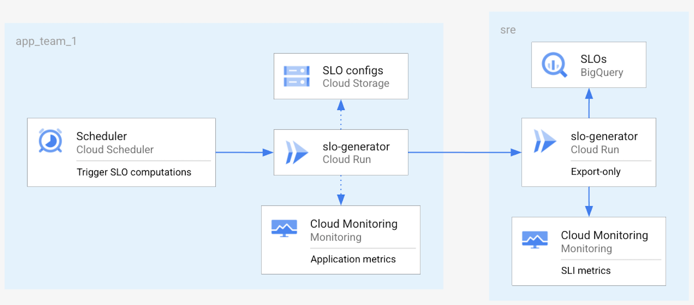

# SLO Generator API

## Description

The **SLO Generator API** is based on the [Functions Framework](https://cloud.google.com/functions/docs/functions-framework) 
allowing deployments to hosted services easier, such as 
[Kubernetes](./../../../deploy/kubernetes.md), [CloudRun](./../deploy/cloudrun.md) 
or [Cloud Functions](./../deploy/cloudfunctions.md).

## Standard mode API

In the standard mode, the `slo-generator` API takes SLO configs as inputs and 
export SLO reports using the `default_exporters` in the shared config, and the 
`exporters` section in the SLO config:

```
slo-generator api --config <CONFIG_PATH>
```
where:
  * `CONFIG_PATH` is the [Shared configuration](../../README.md#shared-configuration) file path or a Google Cloud Storage URL.


The API has two modes of functioning that can be controlled using the 
`--signature-type` CLI argument:

* `--signature-type=http`: can receive HTTP POST requests containing an 
**SLO config**, an **SLO config path**, or a **SLO config GCS URL** in the 
request body:
```
curl -X POST -H "Content-Type: text/x-yaml" --data-binary /path/to/slo_config.yaml <SERVICE_URL> # SLO config (YAML)
curl -X POST -H "Content-Type: application/json" -d @/path/to/slo_config.json <SERVICE_URL>  # SLO config (JSON)
curl -X POST -d "/path/to/slo_config.yaml" <SERVICE_URL> # SLO config path on disk (service needs to be able to load the path on the target machine).
curl -X POST -d "gs://<GCS_BUCKET_NAME>/slo.yaml" <SERVICE_URL> # SLO config GCS URL.
```

* `--signature-type=cloudevent`: can receive HTTP POST requests wrapped in a 
[CloudEvent message](https://github.com/cloudevents/spec/blob/v1.0.1/spec.md#example),
with the actual SLO configs put directly under the `data` key, or in 
base64-encoded string under the `data.message.data` enveloppe.

### Export-only mode API

Some use cases require to have a distinct service for the export part. 
For instance, some SRE teams might want to let application teams compute their 
SLOs, but require them to export the SLO reports to a shared destination like 
BigQuery:



It is possible to run the `slo-generator` API in `export` mode only, by setting 
the `--target` argument to `run_export`:

```
slo-generator api --config /path/to/config.yaml --target run_export
```

In this mode, the API accepts an 
[SLO report](../../tests/unit/fixtures/slo_report_v2.json) in the POST request, 
and exports that data to the required exporters.

The exporters which are used for the export are configured using the 
`default_exporters` property in the `slo-generator` configuration.

Similarly to the standard-mode API, it can be run as an `http` endpoint (the 
SLO report is sent directly in the request body) or as `cloudevent` endpoint (
the SLO report is wrapped in a CloudEvent enveloppe).

### Sending data from a standard API to an export-only API

There are two ways you can forward SLO reports from the standard `slo-generator` 
API to an export-only API:

* If the export-only API is configured with `--signature-type=cloudevent`, then 
you can:

  * Set up a `Cloudevent` exporter in the standard API shared config to send the 
  events directly to the export-only API. See cloudevent exporter [documentation](../providers/cloudevent.md#exporter).

  * Set up a `Pubsub` exporter in the standard API shared config to send the 
  events to a Pubsub topic, and set up an [**EventArc**](https://cloud.google.com/eventarc/) 
  to convert the Pubsub messages to CloudEvent format.

* If the export-only API is configured with `--signature-type=http`, then 
you can:

  * Set up a `Pubsub` exporter in the standard API shared config to send the 
  SLO reports to a Pubsub topic, and set up a Pubsub push subscription 
  configured with the export-only API service URL.

  * [***not implemented yet***] Set up an `HTTP` exporter in the standard API shared 
  config to send the reports.

**Notes:**

* Using a queue like Pubsub as an intermediary between the standard service and 
the export-only service is a good way to spread the load over time if you are 
dealing with lots of SLO computations.

* You can develop your own Cloudevent receivers to use with the `Cloudevent` 
exporter if you want to do additional processing / analysis of SLO reports. 
An example code for a receiver is given [here](https://cloud.google.com/eventarc/docs/run/event-receivers), 
but you can also check out the [Functions Framework](https://cloud.google.com/functions/docs/functions-framework) 
that does the marshalling / unmarshalling of Cloudevents out-of-the-box.
